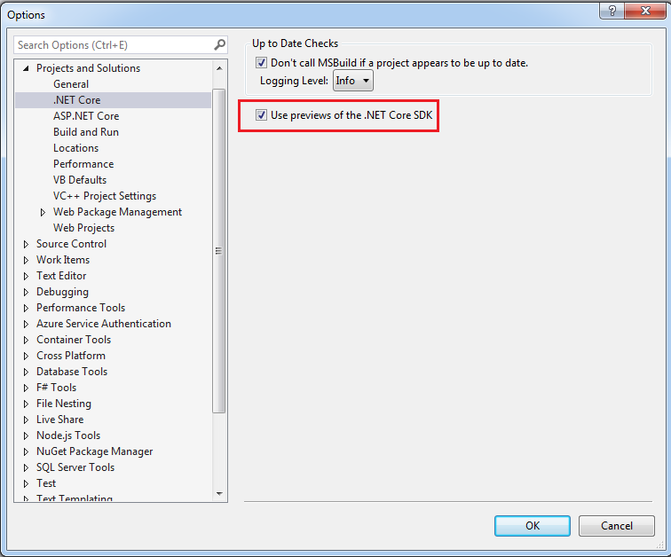

**How to try WinForms Designer for .net core in vs2019**

Author: Bravo Yeung

This article was first published in:

[How to try WinForms Designer for .net core in vs2019 - cnblogs](https://www.cnblogs.com/enjoy233/p/workaround_to_use_the_designer_in_winForms_Core_App.html) .

The visual editor(Designer) for Windows Froms under .net core will be supported in Visual Studio 2019 Update. Currently vs2019 doesn't support Designer. To use Designer in vs2019, we gives out a temporary method.

We can use the "Link files" function via Visual Studio，and then apply WinForms Designer to Classic Framework (Win Froms projects under .net Framework).

The solution is to create two projects under the same `Solution`：

- one .net core project, to run .NET Framework application of the WinForms application
- one .net Framework project, to run .NET Core application of the WinForms application

The two applications(.net core projects and its related .net Framework project) have the same references.

In this solution，if we want to add new `Win Form` or new `UserControl`，we need to re-config the nested hierarchical relationship of the file `Form` in the .net Framework project`Classic Framework WinForms`.

We recommend not to use text editor to edit the `.csproj` file. Instead, we recommend to use Mad Kristensen' [FileNestingExtention](https://marketplace.visualstudio.com/items?itemName=MadsKristensen.FileNesting). We can install this `vs` plugin in advance.

**Step by step: **

#### Install vs 2019 professional/enterprise version

Create a win forms application under .net core,

After configured the project names and paths, the message will pop up,

#### In settings, check "Use preview SDK" under .NET core framework

Need to restart vs to activate this setting.

#### Use the vs built-in template, choose the .net core forms template to create the project, name the project as "CoreHelloForm"

Now the file directory is:

#### In the created solution, use the vs built-in template, choose the .net framework forms the add a new project，name the project as "CoreHelloForm.Designer"

Now the file directory in `Solution` is:

#### Rename From1 in .net core form to MainForm

Now，right click the .net core form project，select “Set as start up project”，press F5 to run the project，we can see the form:

Click the `x` in the top right corner of the form, stop running,

#### Test whether we can build the `.net core` project from console commands

Right click the .net core form project，select "Open Folder in File Explorer",

Delete the `bin` folder,

In the address bar, input `cmd` to open the console command window:

Input `dotnet --version`. If we can see the .net core version, move on to the next steps.

Input `dotnet build`,

Now, go back to the path `D:\Coding\csProj\CoreHelloForm\CoreHelloForm\bin\Debug\netcoreapp3.0`，double click the exe file in this path. The form should run and display.

#### Delete all the files related to From1 under the project `CoreHelloForm.Designer`

Click `From1` under `CoreHelloForm.Designer`，right click "Delete"，

Warning message would display, click `OK`.

#### In the project `CoreHelloForm.Designer, reference MainFrom related files under the project .net core form, the reference method is "As Link"

Click the project `CoreHelloForm.Designer`，right click Add，select "Existing Item",

The file selection box is opened. Select the three highlight files under the .et core project `CoreHelloForm`, as in the screenshot,

Click`Add As Link`。

#### Download and install the extension File Nesting from extension market

Installation path: [File Nesting for VS](https://marketplace.visualstudio.com/items?itemName=MadsKristensen.FileNesting)

#### Use File Nesting to change file nestings of the MainFrom related file links

Right click "File Nesting" -> "Auto-nest selected items",

Then right click "File Nesting" -> "Nest item"，select `MainForm`,

Click `OK `to continue.

#### Rename again

Rename the `From1` under `.Designer` -> `Program.cs` to be `MainForm`,

#### Reset the start up project

Select the project CoreHelloForm.Designer，right click Rebuild; select the .net framework project CoreHelloForm.Designer，right click “Set as start up project”,

#### Close the interference files to the `MainForm` under the project CoreHelloForm.Designer

Now，if we try to double click the `MainForm.cs` in the project CoreHelloForm.Designer, warning message will display as follows,

This is because the files linked to `MainForm.cs` in the project CoreHelloForm.Designer is already opened in CoreHelloForm.

We close all the opened files related to the From under `CoreHelloForm.Designer`, for instance：

#### Try the Designer

Now，double click `MainForm.cs` in the project CoreHelloForm.Designer，we can see the Designer。

Now, we can do visuable edits.

For example, I made several changes as follows,

- Change the Title of the Form,

- Change the context in the textbox,

- Change the Icon of the Form,

Press `F5`，running result as follows,

Codes of the project committed to `github`，welcome to `Fork` and `star`.
The portal: [.netCore-WinForms_Designer](https://github.com/yanglr/.netCore-WinForms_Designer) .

**Reference Materials**

[WinForms Core App - A workaround invoking the Classic Framework Designer](https://github.com/dotnet/winforms/blob/1225f79dce17253a629d1a65c3c13f7a77cbaba1/Documentation/winforms-designer.md).
